title: Make a Campaign
---
## What is Campaign?
Campaign is a Powerful tool to Broadcast your promotional or non-promotional Message to the target followers of your Facebook Page using Chatbotman. You can specify when to send out the broadcast message and who will receive it. The broadcast message is highly customizable that you can send text message, image, quick reply or a card to the target audience.

# Create a Campaign

## Step 1: Go to Campaign
Go to **Campaigns**, and click **Create Campaign** to create a campaign.

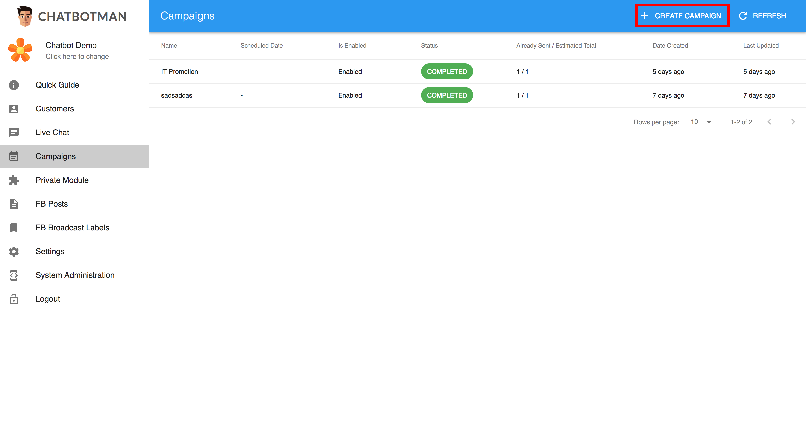

## Step 2: Campaign Mechanism
In the **Campaign Mechanism** section, you can choose whether the broadcast campaign will be sent out by scheduled time or immediately. If **Send by Scheduled Time** is chosen, you also need to specify the scheduled time. Then, click **Next** to continue.

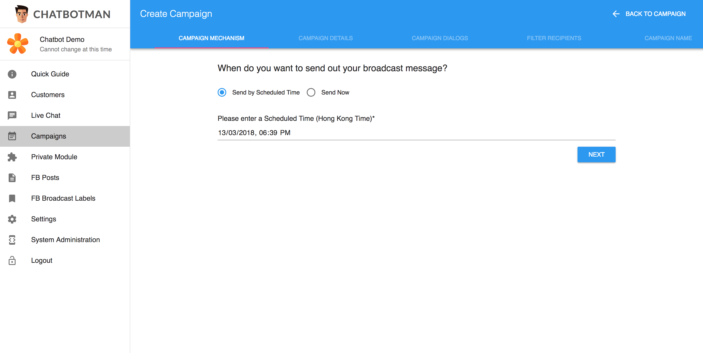

## Step 3: Campaign Details
In the **Campaign Details** section, we assume that you need to choose whether the broadcast message is a **promotional message** or **non-promotional message** since it is under different policies. Currently, only **non-promotional message** is available as Chatbotman is still on beta version. For more details, please read [Messenger Platform - Platform Policy Overview](https://developers.facebook.com/docs/messenger-platform/policy/policy-overview).

If **Non-promotional Message** is chosen, you also need to specify the type of the broadcast message. By default, **Non-promotional Subscription** is selected. However, you can change to other types such as **Pairing Update**, **Game Event** if you want. For more details, please read [Messenger Platform - Sending Messages](https://developers.facebook.com/docs/messenger-platform/send-messages#message_types).

If you have finished this step, click **Next** to continue.

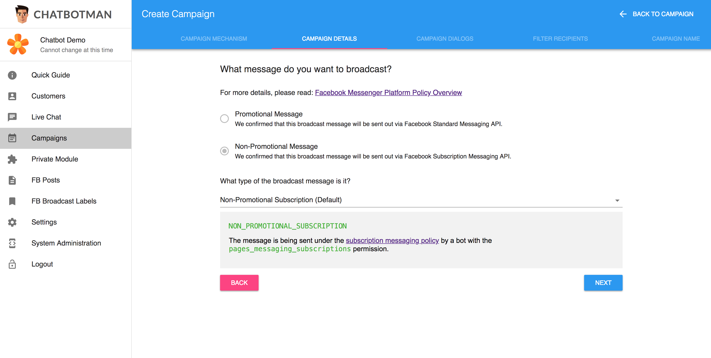

## Step 4: Campaign Dialogs
In **Campaign Dialogs** section, you can build your broadcast message.

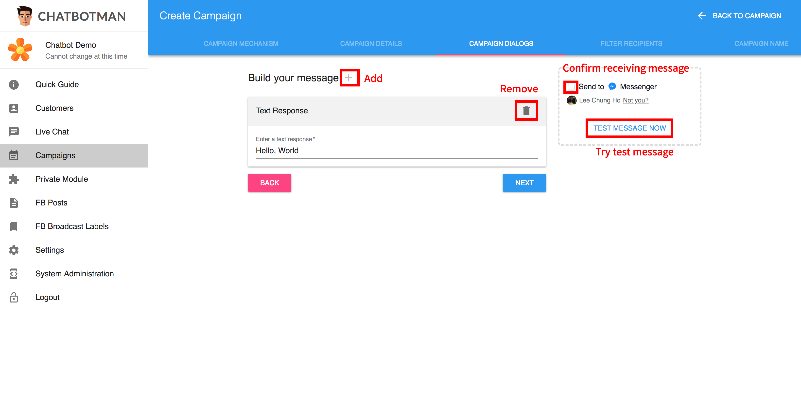

By default, **Text Response** is added for you. If you want to send other message format, you can remove the **Text Response** by clicking the **Trash** button on the top right corner. Then, add another type of message.

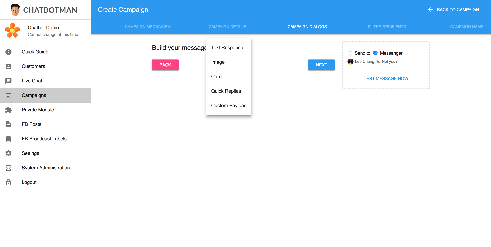

Say, if you **Quick Replies** message is selected, you need to input a **Title** as well as the **Quick Reply Options**.

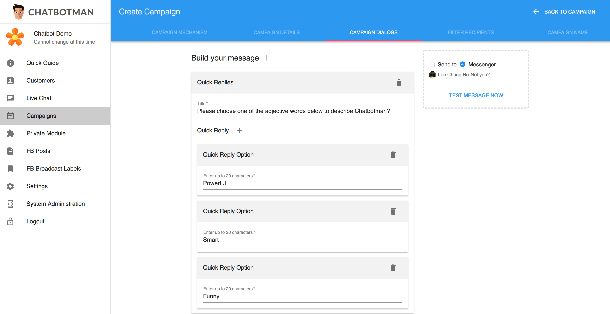

If your are finished editing your message, you can test your message by using the **Test Message** button on the top right corner. But please remind that you should tick the **Send to Messenger** checkbox first to allow us to send message to your Facebook account.

If you try the **Test Message** button successfully, you will get your test message like this.

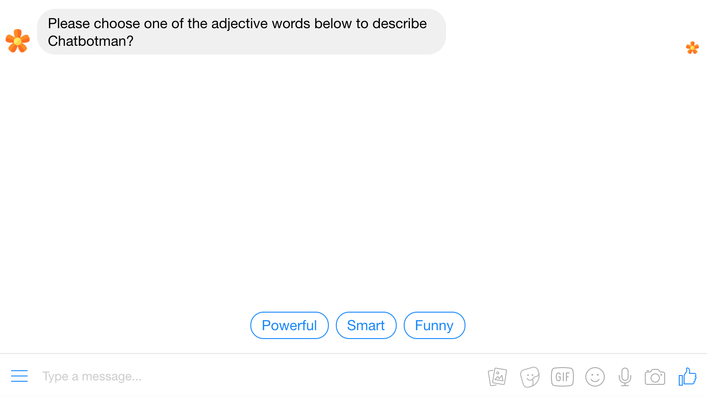

If you have finished this step, click **Next** to continue.

## Step 5: Filter Recipients
In **Filter Recipients** section, you can add a **Facebook Label** to filter your target recipients. You can add your Facebook Labels for your Facebook Page in **FB Broadcast Labels**. For more details, please read the [Facebook Labels](facebookLabels.html) tutorial.

If you simply want to broadcast this message to all followers, you can ignore this section.

You may see a circle on the right which can estimate how many recipients will receive your message. If you change the filter, the result will be re-evaluate automatically.

If you have finished this step, click **Next** to continue.

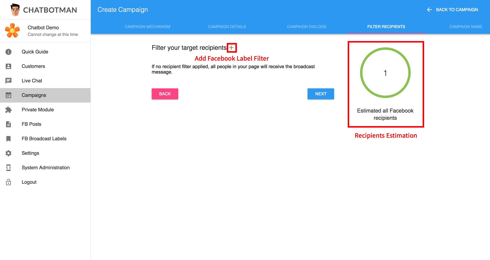

## Step 6: Give a Name for Your Campaign
Finally, give a name for your campaign, then click **Create** to create your campaign.

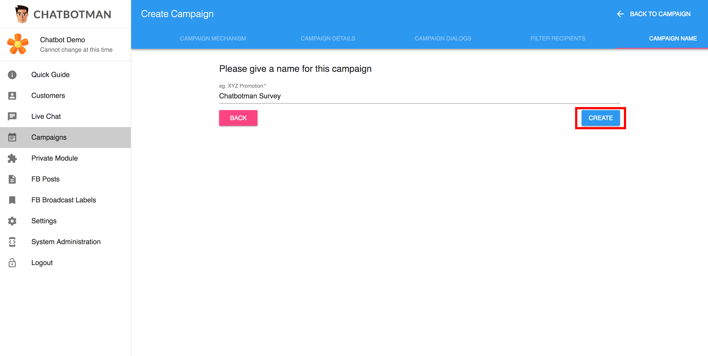

# Edit a Campaign

## Step 1: Find your Campaign
In **Campaigns**, find your campaign and click it to edit.

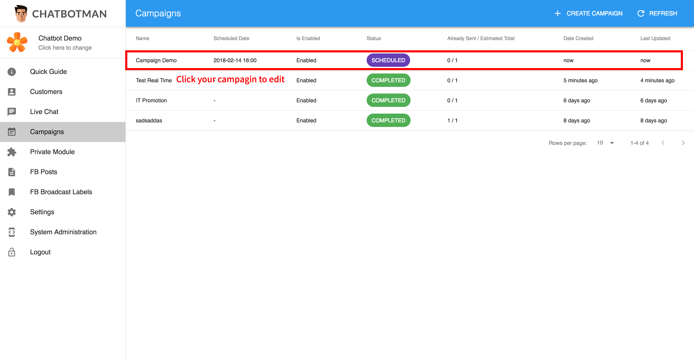

## Step 2: Campaign Settings
In the **Campaign Settings**, you can see the campaign status and the current estimated amount of recipients who received the message. Please note that the estimation may not be absolutely real-time which just for your reference only. 

You can disable the campaign only when the campaign status is in **Scheduled**. Just click the switch to disable / re-enable the campaign. You don't need to click the **Update** button in the final section.

If you have finished this step, click **Next** to continue.

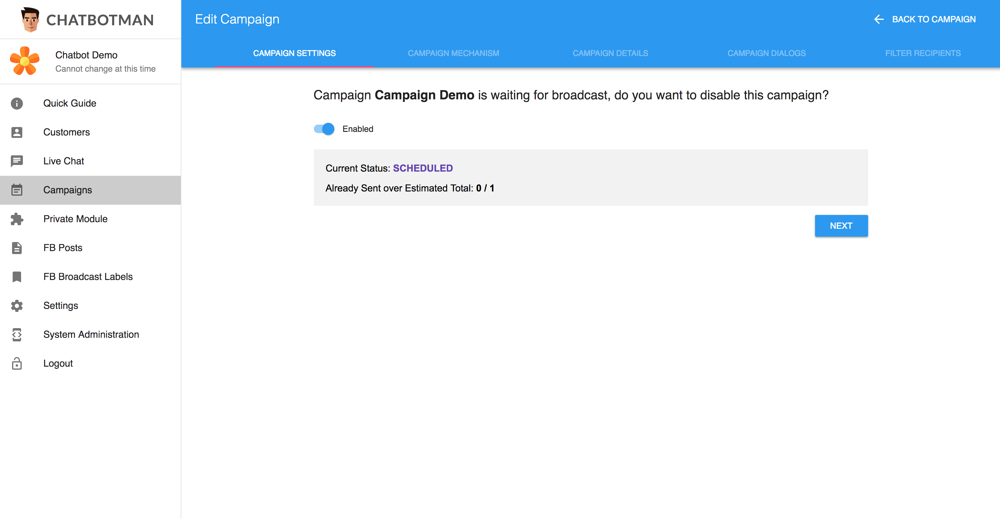

## Edit your Campaign
The other sections are the same to **Create Campaign**. In the final section, click the **Update** button to update the campaign.

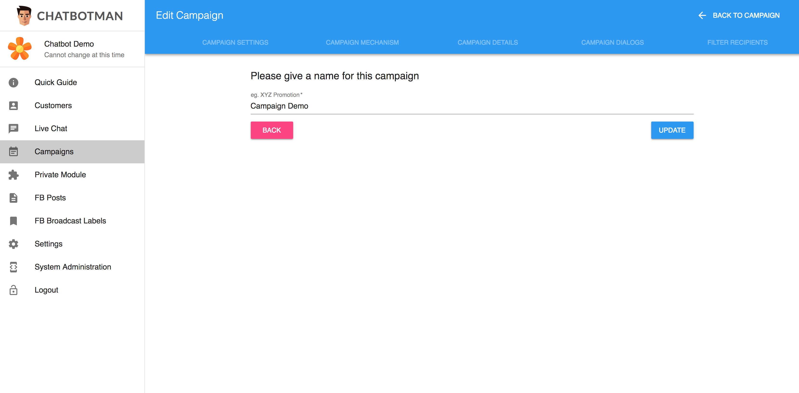

## That's Easy🙃