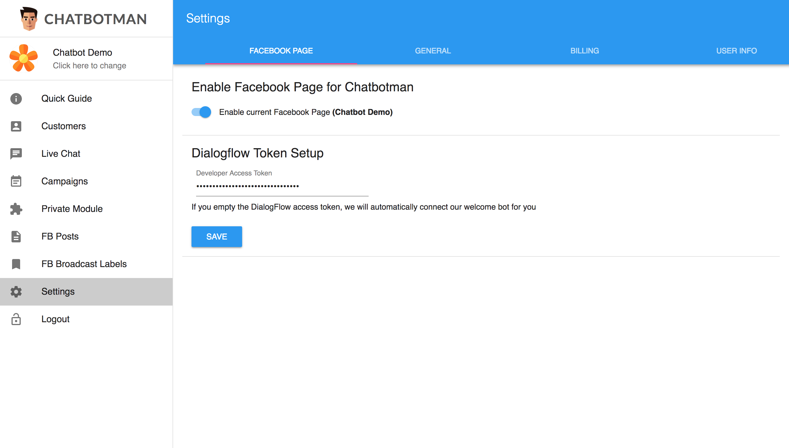
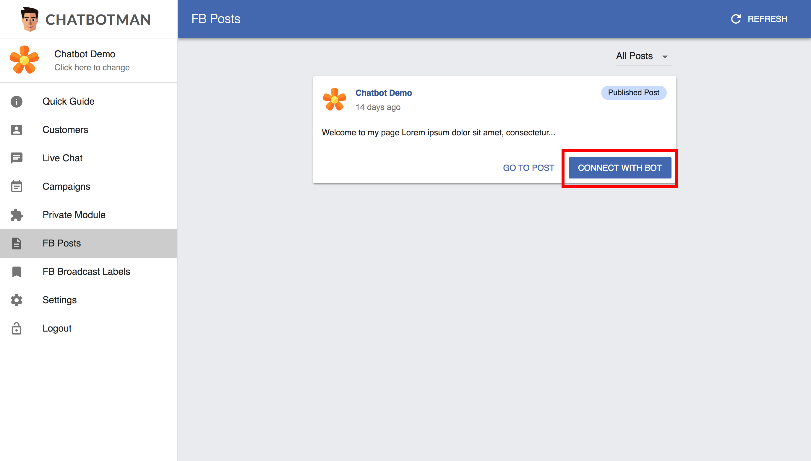
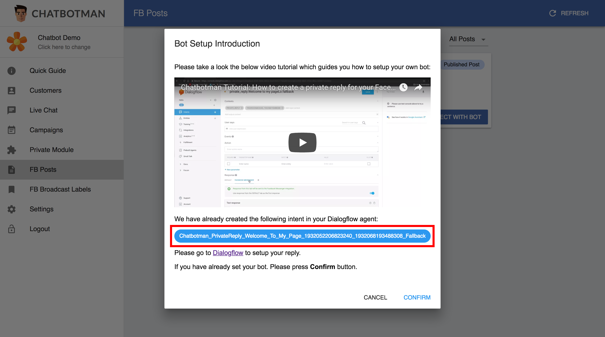
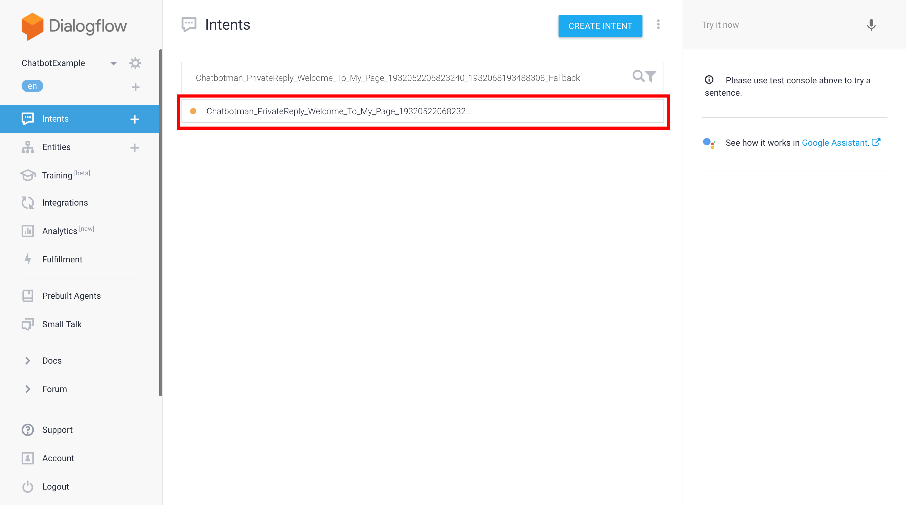
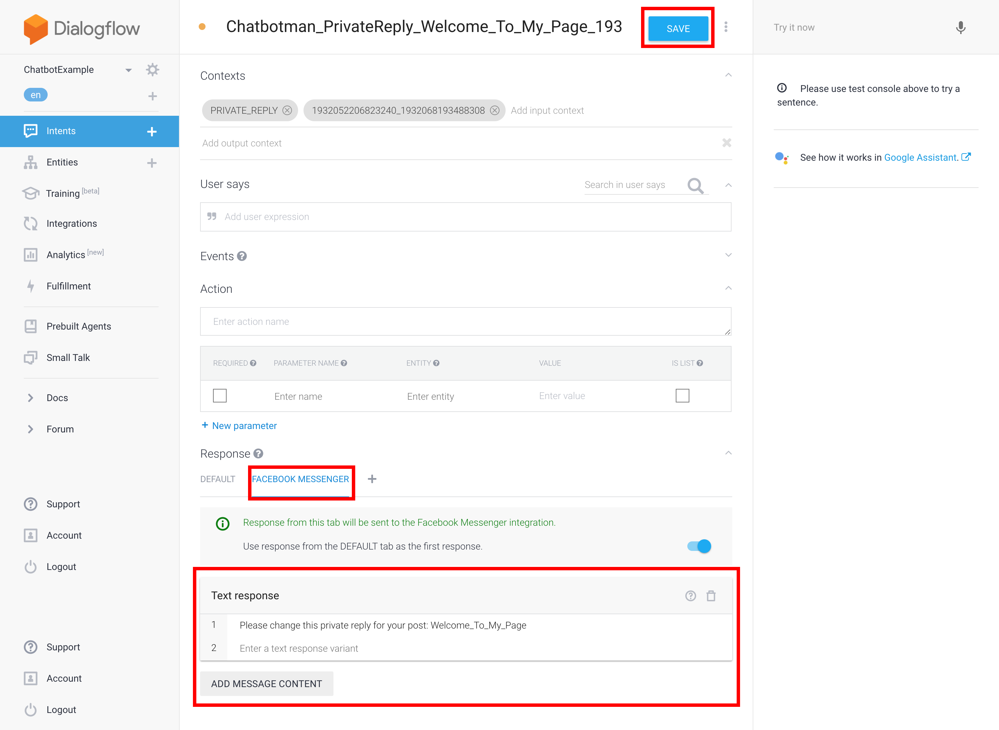
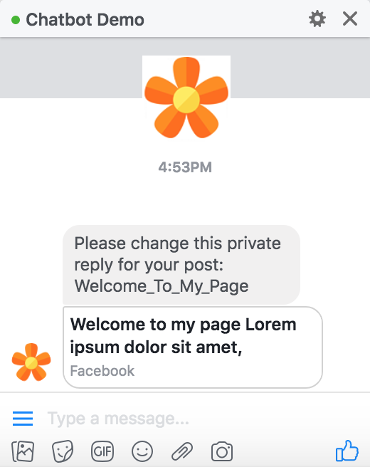

title: Create a Private Reply
---
## What is private reply?
When your Facebook follower reply your post, the chatbot can pop up and Reply the Follower Quickly with the post Related Information. With Help of Chatbotman and Dialogflow, the chatbot can understand which post the follower is replied and give the related response to Hit the Follower Needs.

In this tutorial, you will learn how to make a private reply for a specific post in your Facebook page.

## Step 0: Ensure the Facebook page is enabled for Chatbotman
Select your **Facebook page** on the top-left dropdown menu which you want to add a private reply for the post.

Go to **Settings > Facebook Page**, ensure the Facebook page has been enabled and with the Dialogflow developer access token on it. If didn't, please enable the Facebook page by clicking the switch button, type your own Dialogflow developer access token (See [Setup Your First Chatbot](setup.html)), and click the **Save** button to save it.

## Step 1: Connect to your Facebook post
To connect your Facebook post with your chatbot, simply find your post in **FB Posts** section and click **Connect with bot**. If you currently created a post, you can click **Refresh** button on the top right corner to refresh the post list.

## Step 2: Get the Dialogflow intent name
When you click **Connect with bot**, a pop-up **Bot Setup Introduction** dialog will tell you how to setup your bot with private reply. We recommend you to watch the video first.

## Step 3: Find your private reply intent in Dialogflow
Basically, a new intent which is for handling the private reply will be created by our Chatbotman app automatically. You can go to [Dialogflow Console](https://console.dialogflow.com/) to find the intent. Then, click the intent to edit.

## Step 4: Edit the intent with your custom response
In your intent, scroll to the bottom and click the **Facebook Messenger** tab. You will see a default **Text Response** for your intent. It means that when the follower replied your Facebook post, the chatbot will response to the follower with this intent. Therefore, you can simply change the text response. Or, if you don't want a text response, you can click the **trash** button on the  **Text Response** section and add whatever you want by clicking the **Add Message Content** button.

Please remind to click the **Save** button on the top after you finished editing your intent.

## Step 5: Test it
Finally, try to reply your post using with your own personal identity to see whether the chatbot will response to you. If you do all the things correctly, you will see the chatbot response to you like this:

## Is Chatbotman AMAZING🤩?