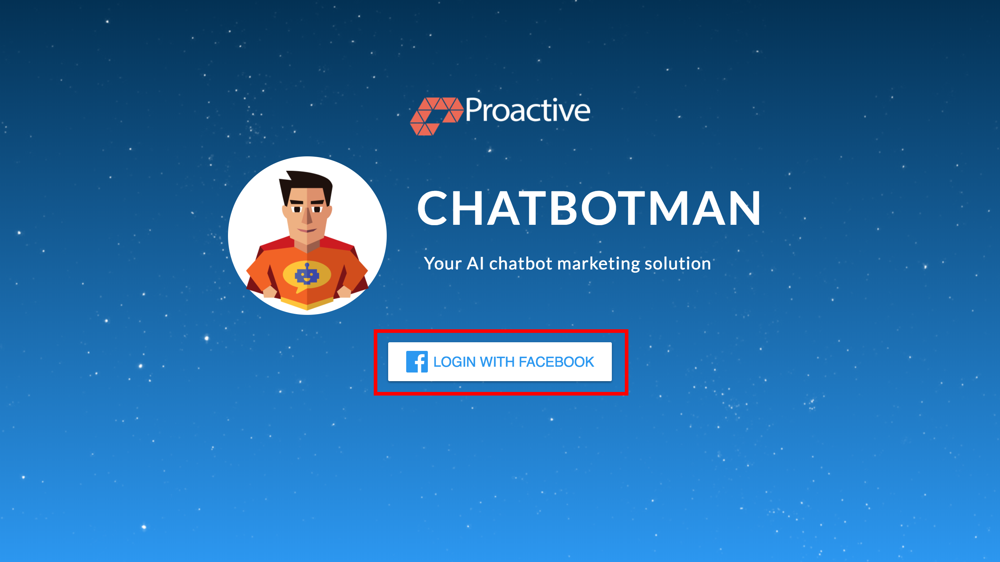
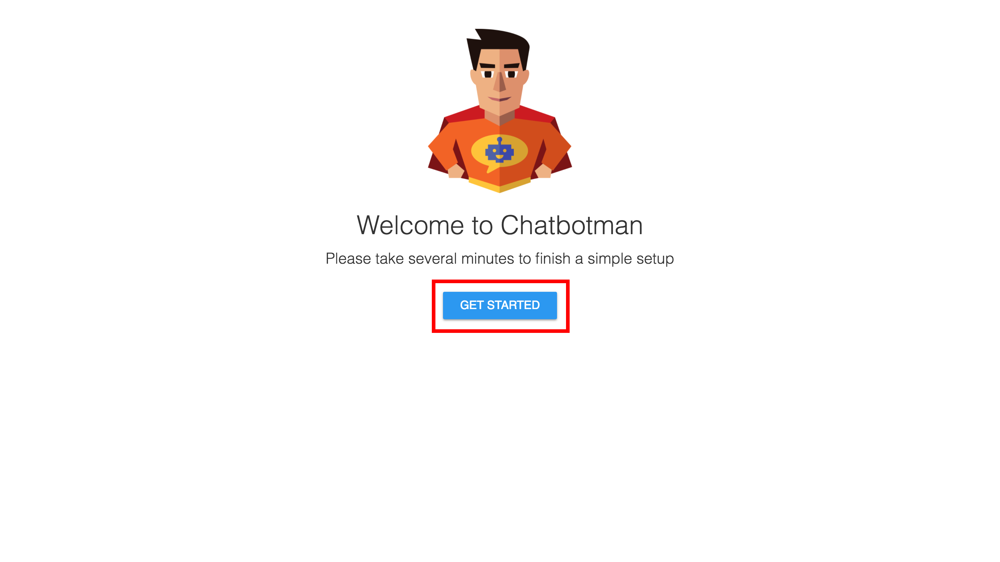
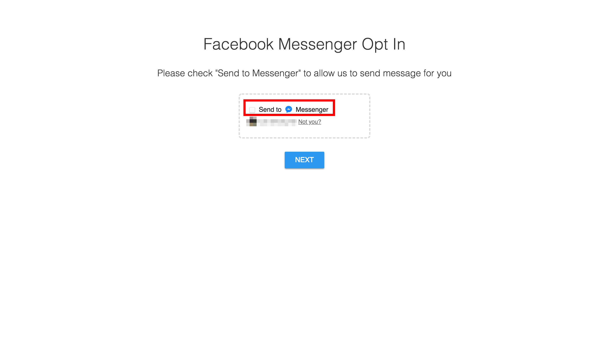
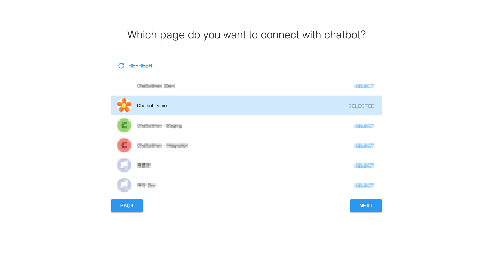
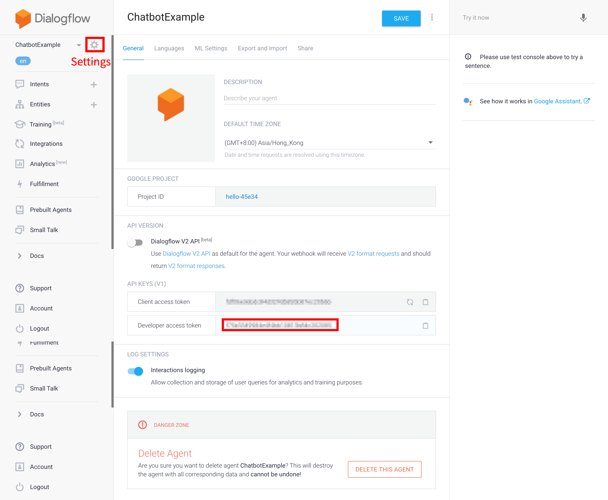
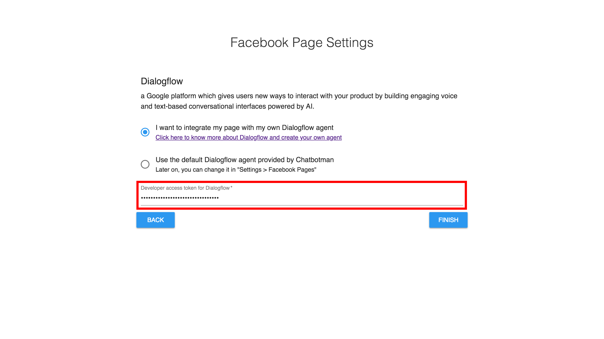

title: Setup Your First Chatbot
---
## Step 1: Login to Chatbotman app
Click **Login with Facebook** to login chatbotman with your Facebook account.

## Step 2: Begin the first setup
Click **Get Started** to begin the first setup.

## Step 3: Confirm the Facebook Messenger Opt In
Tick **Send to Messenger** checkbox to allow us to send message for you. Then, click the **Next** button to continue the setup.

## Step 4: Confirm your user info
By default, we would use your Facebook name and email for Chatbotman general notification only. If you want to change your name and email for Chatbotman, you may change it now. Then, click the **Next** button to continue the setup.

## Step 5: Connect chatbot to your page
We assume that you have already had a Facebook page. If you don't have a Facebook page, please follow [this tutorial](https://www.facebook.com/business/help/104002523024878) to create your Facebook Page.

Select your favor Facebook page which you want to connect with our chatbot. Then, click the **Next** button to continue the setup.

## Step 6: Login to Dialogflow
Click [here](https://console.dialogflow.com/api-client/#/login) to login to your Dialogflow using your Google account.

## Step 7: Create a Dialogflow Agent
Click the dropdown menu on the top-left corner. Then, type an agent name you like and click **Create** to create agent.

## Step 8: Get the developer access token of the Dialogflow Agent
Select your agent on the top-left dropdown menu. Then, click **Settings** to get the **developer access token**.

## Step 9: Setup Dialogflow for your page
Back to Chatbotman app, copy your **developer access token** to the Facebook Page Settings. Then, click **Finish** to finish the first setup.

## Step 10: Test it
Now, you have already connected a new chatbot to your Facebook page using our Chatbotman app. You can send "Hey" to your Facebook page using [Facebook Messenger](https://www.messenger.com/) and see whether you get the default fallback response by the chatbot.

Usually, you may get a response like "**I didn't get that. Can you say it again?**" which is because your agent have no intent for handling your message. To make the chatbot really works, you need to read the [documentation](https://dialogflow.com/docs/getting-started/building-your-first-agent) by Dialogflow to learn how to create intents and entities in your Dialogflow agent.

## Now, you know how to Build Chatbot On Chatbotman😎