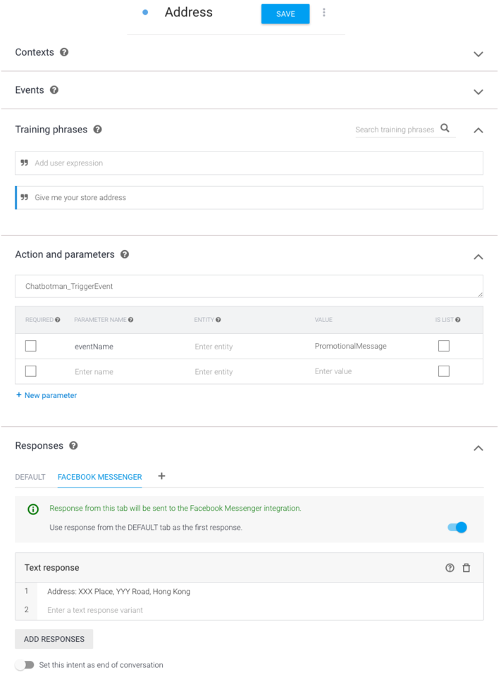
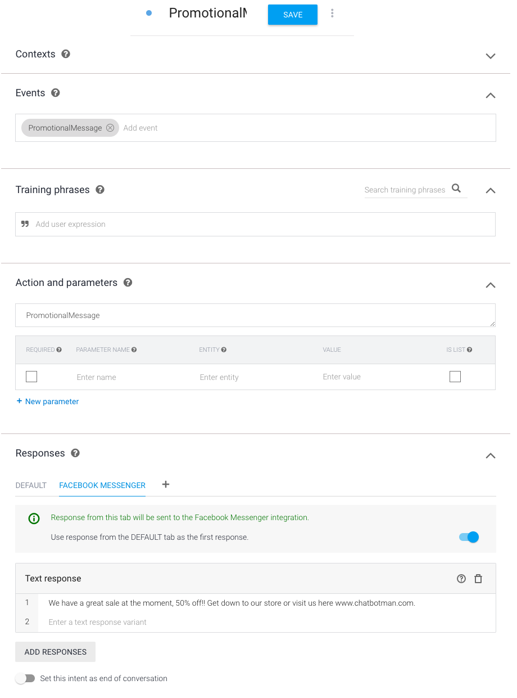
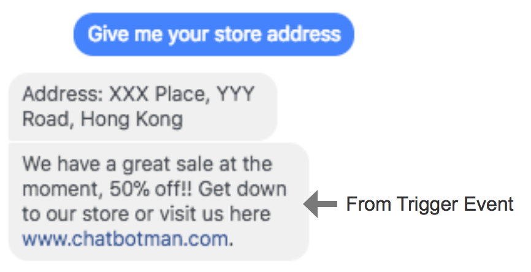

title: Trigger Event
---

## What is Trigger Event?

Trigger event is a chatbotman built-in function that let you trigger Dialogflow intents by outputting an event. It allows you to achieve the following purposes:

1. When you want to say something after the conversation end.
2. When you want to add promotional message after replying the subscribe.

## Implementation

You need to output an event named `Chatbotman_TriggerEvent`. Chatbotman will detect this event name and trigger and intent for you. 

Here is an example intents of trigger event.

First, create an intent that output `Chatbotman_TriggerEvent` action and output a paramter called `eventName` with value `PromotionalMessage`

Second, create an intent that accept `PromotionalMessage` event.

The output would be like this.

